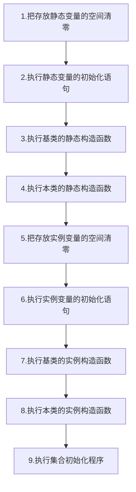

构造某个类型的首个实例时系统所做的工作:

```mermaid
flowchart TB
	A[1.把存放静态变量的空间清零</br>] --> B[2.执行静态变量的初始化语句] --> 3.执行基类的静态构造函数 --> 4.执行本类的静态构造函数 --> 5.把存放实例变量的空间清零 --> 6.执行实例变量的初始化语句 --> 7.执行基类的实例构造函数 --> 8.执行本类的实例构造函数 --> 9.执行集合初始化程序
```