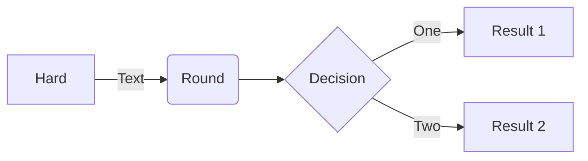
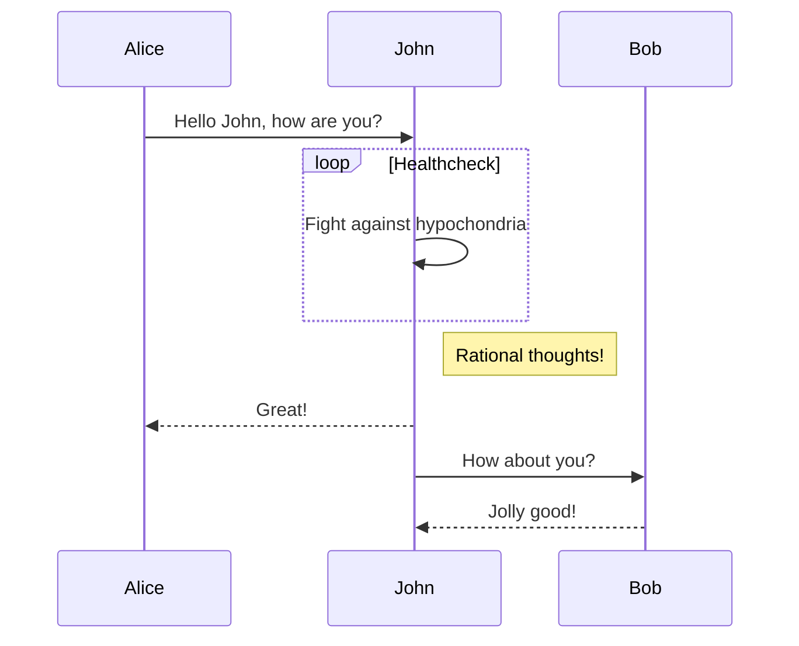
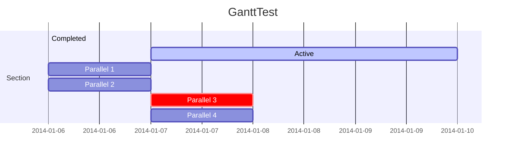
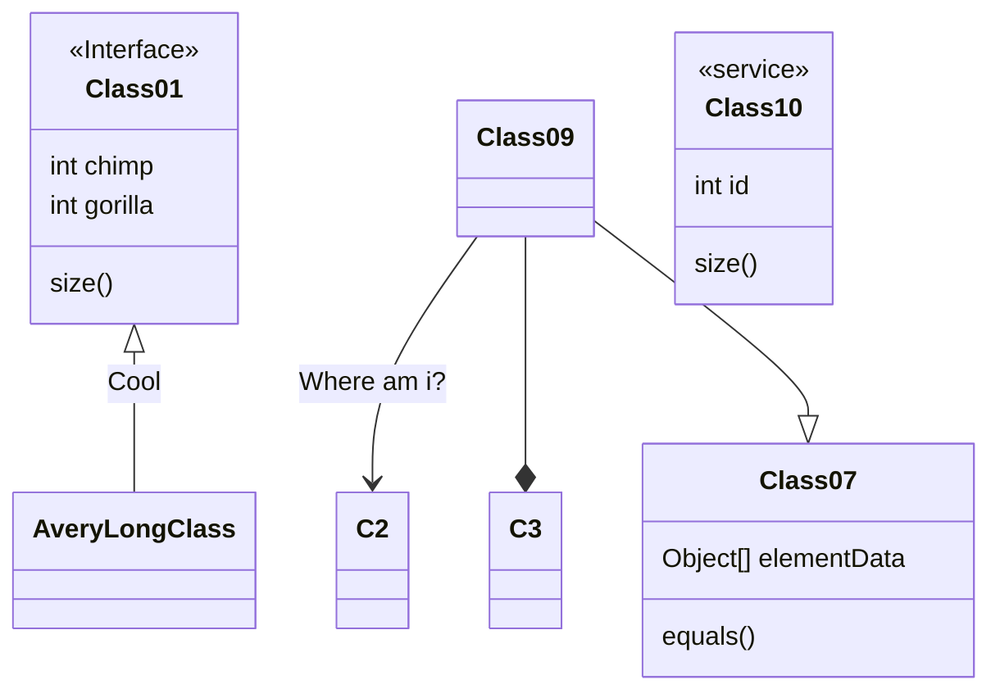
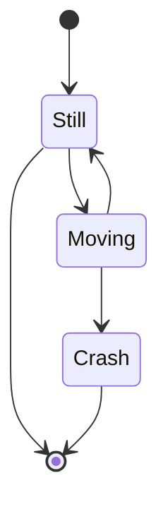
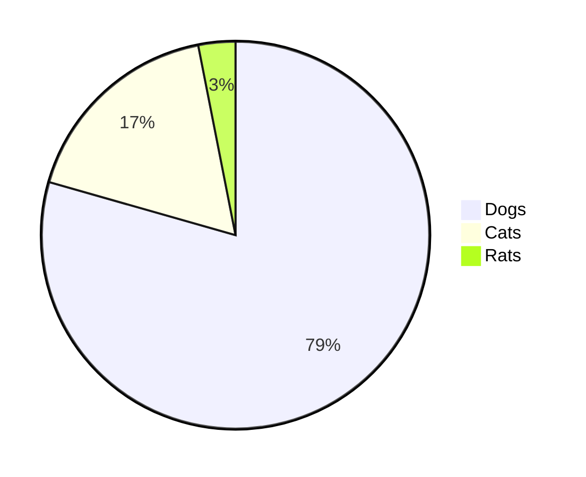

Mermaid 是一个基于 Javascript 的图表绘制工具，通过解析类 Markdown 的文本语法来实现图表的创建和动态修改。

>如果使用Jekyll发布，FrontMatter中需要添加 `mermaid: true`
{: .prompt-info }


## 流程图

[Flowchart](https://mermaid-js.github.io/mermaid/#/flowchart)

```markdown
flowchart LR
A[Hard] -->|Text| B(Round)
B --> C{Decision}
C -->|One| D[Result 1]
C -->|Two| E[Result 2]
```




## 时序图

[Sequence diagram](https://mermaid-js.github.io/mermaid/#/sequenceDiagram)

```markdown
sequenceDiagram
Alice->>John: Hello John, how are you?
loop Healthcheck
    John->>John: Fight against hypochondria
end
Note right of John: Rational thoughts!
John-->>Alice: Great!
John->>Bob: How about you?
Bob-->>John: Jolly good!
```




## 甘特图

[Gantt](https://mermaid-js.github.io/mermaid/#/gantt)

```markdown
gantt
	title GanttTest
    section Section
    Completed    :done,     des1, 2014-01-06,2014-01-08
    Active       :active,   des2, 2014-01-07, 3d
    Parallel 1   :          des3, after des1, 1d
    Parallel 2   :          des4, after des1, 1d
    Parallel 3   :crit,     des5, after des3, 1d
    Parallel 4   :          des6, after des4, 1d
```



## 类图

[Class Diagram](https://mermaid-js.github.io/mermaid/#/classDiagram)

```markdown
classDiagram
Class01 <|-- AveryLongClass : Cool
<<Interface>> Class01
Class09 --> C2 : Where am i?
Class09 --* C3
Class09 --|> Class07
Class07 : equals()
Class07 : Object[] elementData
Class01 : size()
Class01 : int chimp
Class01 : int gorilla
class Class10 {
  <<service>>
  int id
  size()
}
```



## 状态图

[State Diagram](https://mermaid-js.github.io/mermaid/#/stateDiagram)

```markdown
stateDiagram-v2
[*] --> Still
Still --> [*]
Still --> Moving
Moving --> Still
Moving --> Crash
Crash --> [*]
```



## 饼图

[Pie Chart](https://mermaid-js.github.io/mermaid/#/pie)

```markdown
pie
"Dogs" : 386
"Cats" : 85
"Rats" : 15
```




## Reference

1. [mermaid-js](https://github.com/mermaid-js/mermaid/blob/develop/README.md)
